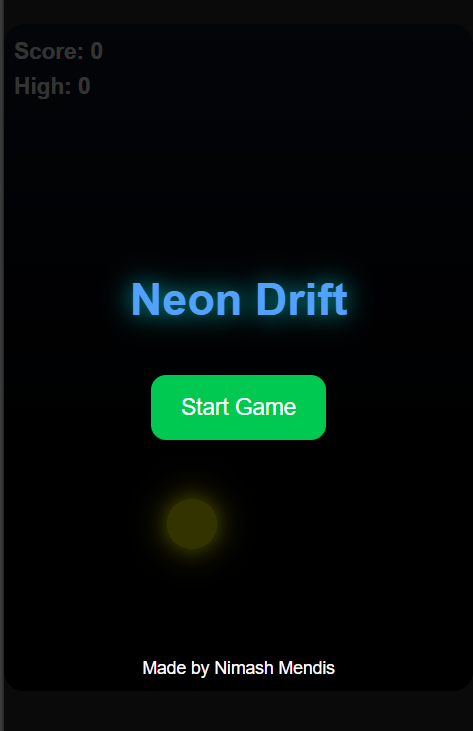
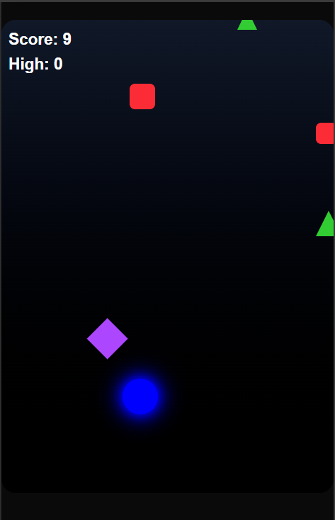
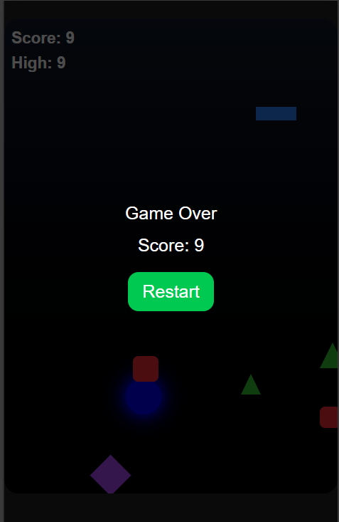

# Neon Drift

Neon Drift is a fast-paced, mobile-friendly reflex game where you control a neon dot and dodge falling obstacles. The game becomes progressively harder as obstacles speed up, featuring vibrant neon colors and simple touch/mouse controls.

## Features

- Drag the neon dot to dodge obstacles
- Randomly changing neon dot colors
- Obstacles of multiple shapes: square, rectangle, triangle, diamond
- Score increases with survival time
- Increasing difficulty over time
- Start screen and Game Over screen
- Mobile and desktop friendly

## Demo

- Demo link [Neon Drift](https://neon-drift-five.vercel.app)

## Images





## Installation

1. Clone the repository:

```bash
git clone https://github.com/n1cKar/neon-drift.git
cd neon-drift
```

2. Install dependencies:

```bash
npm install
```

3. Run the development server:

```bash
npm run dev
```

4. Open http://localhost:3000 in your browser to play.


## Controls

- Touch (mobile): Drag your finger to move the dot.
- Mouse (desktop): Click and drag the dot to move.

## Built With

- Next.js
- TypeScript
- Tailwind CSS
- React

## Contact 

- For questions, suggestions, or feedback, reach out via email: [Nimash Mendis](emailto:nimash.mendis0202@gmail.com)